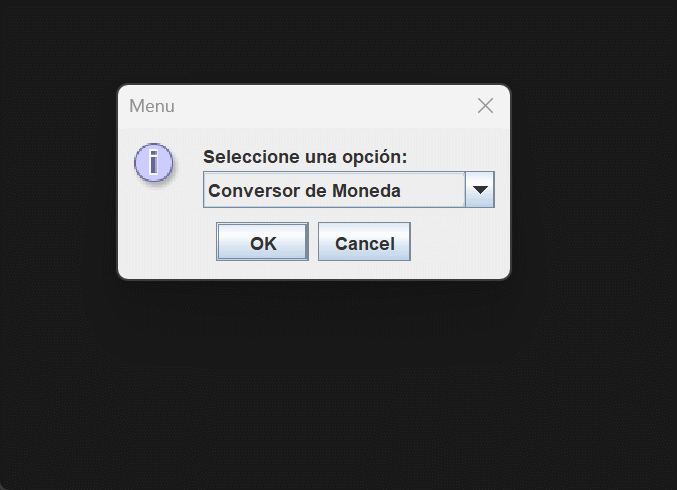
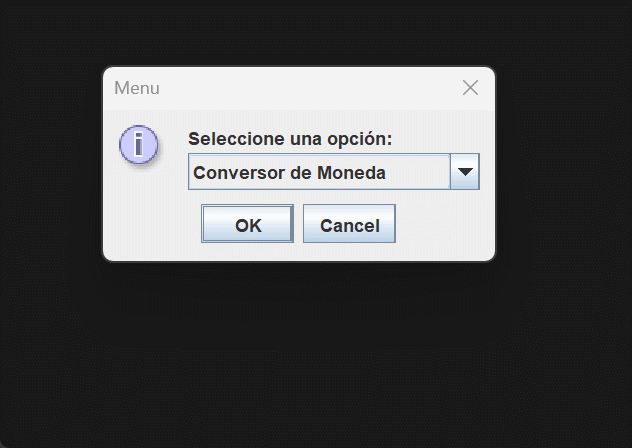
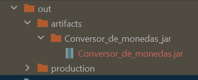

# Conversor de moneda y temperatura
## Índice
- [Descripción del proyecto](#"Descripción del proyecto")

- [Funcionalidades](#Funcionalidades)

- [Ejecutable](#Ejecutable del proyecto)

- [Tecnologías utilizadas](#Tecnologías utilizadas)

- [Desarrolladores](#Desarrolladores)
## Descripción del proyecto
Proyecto Conversor de moneda y temperatura. Convierte pesos colombianos a dólares, euros, libras esterlinas, yen japonés, won surcoreano y viceversa. También realiza conversión de temperaturas de grados Celsius a Fahrenheit, Kelvin, Rankine y de grados Fahrenheit a Celsius, Kelvin, Rankine.
## Funcionalidades
### Conversor de Moneda

- De Pesos(COP) a Dólar(USD)
- De Pesos(COP) a Euros(EUR)
- De Pesos(COP) a Libras Esterleinas(GBP)
- De Pesos(COP) a Yen Japonés(JPY)
- De Pesos(COP) a Won sur-coreano(KRW)
- De Dólar(USD) a Pesos(COP)
- De Euros(EUR) a Pesos(COP)
- De Libras Esterleinas(GBP) a Pesos(COP)
- De Yen Japonés(JPY) a Pesos(COP)
- De Won sur-coreano(KRW) a Pesos(COP)
### Conversor de Temperatura

- Celsius(ºC) a Fahrenheit(ºF)
- Celsius(ºC) a Kelvin(K)
- Celsius(ºC) a Rankine(ºR)
- Fahrenheit(ºF) a Celsius(ºC)
- Fahrenheit(ºF) a Kelvin(K)
- Fahrenheit(ºF) a Rankine(ºR)
## Ejecutable del proyecto

Para ejecutar el proyecto lo hacemos desde el archivo .jar ubicado en la ruta "out\artifacts\Conversor_de_monedas_jar\Conversor_de_monedas.jar"
## Tecnologías utilizadas
- Java
## Desarrolladores
- Edwin Córdoba
